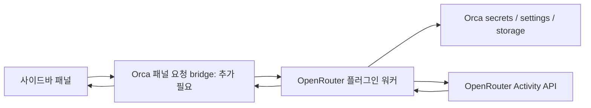

# Orca OpenRouter Usage 설계

작성일: 2026-09-12. 상태: 문서·소스 분석 완료, 구현 전.

목표는 Orca 오른쪽 사이드바에서 OpenRouter 비용과 토큰 사용량을 확인하는 플러그인이다. 현재 작업 저장소에는 README만 있다.

## 1. 결론

권장 구조는 **샌드박스 패널 + Node 워커 + Orca 비밀 저장소**다. 다만 조사한 Orca 소스에는 패널에서 워커로 요청하는 공개 연결점이 없다. 따라서 완성형 대시보드는 해당 연결 기능을 Orca에 먼저 추가하거나, 이를 제공하는 배포 버전을 확인해야 한다.

플러그인만으로 가능한 명령 기반 조회는 기술 검증용으로 활용한다. 이것을 대시보드가 완성된 것으로 취급하지 않는다. 아래에서 기존 기능과 새로 제안하는 기능을 구분한다.

## 2. 제공된 예제 분석

| 자료 | 확인한 구조 | 이번 플러그인에 적용 |
| --- | --- | --- |
| Orca Settings 문서 | 시스템 활성화 후 플러그인별 검토·활성화, Git 마켓플레이스, 로컬 워커 | 설치 및 배포 흐름 |
| navigation-shortcuts | `orca-plugin.json` 한 개, `contributes.commands`의 내장 action과 `keybindings`, 빈 capabilities | manifest 형식과 선택적 단축키 |
| multipass-recipes | manifest의 `contributes.vmRecipes`가 별도 JSON 참조 | 리소스 분리와 버전 배포 방식 |
| Orca 본체 hello-orca | `main.mjs`, `panel.html`, commands, events, capabilities | 실행형 플러그인의 출발점 |

단축키 예제는 내장 Orca action을 선언하므로 워커가 필요 없다. Multipass 예제의 JSON은 VM 생성·중지·재개·삭제 명령을 제공한다. 두 저장소 모두 HTTP 클라이언트나 데이터 패널 구현 예제는 아니다.

출처: [Settings](https://www.onorca.dev/docs/settings#plugins-experimental), [단축키 manifest](https://github.com/stablyai/orca-navigation-shortcuts/blob/b262283a2a3a9a4f1a8f5dc5e442dc4325f2c431/orca-plugin.json), [레시피 manifest](https://github.com/stablyai/orca-multipass-recipes/blob/8606f0eee47f30e60cde69cb2d70e58413b61e23/orca-plugin.json), [VM 레시피](https://github.com/stablyai/orca-multipass-recipes/blob/8606f0eee47f30e60cde69cb2d70e58413b61e23/recipes/ubuntu-lts.json), [hello-orca](https://github.com/stablyai/orca/tree/403b62a8d8fa6e896a93acc4c15405be0f0b7dc7/examples/plugins/hello-orca).

## 3. Orca에서 확인한 지원 범위

| 항목 | 조사한 소스의 상태 | 설계 영향 |
| --- | --- | --- |
| 오른쪽 사이드바 패널 | `contributes.panels` 지원 | 기본 화면 위치 |
| 워커 명령 | `orca.commands.register` 지원 | API 요청과 집계 담당 |
| 비밀·설정·데이터 저장 | `secrets.*`, `settings.*`, `storage.*`, 워커 전용 | 패널에 저장된 키를 반환하지 않음 |
| 패널 직접 HTTP | CSP `connect-src 'none'` | 워커에서 요청 |
| 패널→워커 호출 | 현재 공개 bridge에 없음 | 호스트 확장이 선행 조건 |
| 패널에서 사용 가능한 host action | workspace 조회, terminal 전송, notification | 사용량 요청이나 키 입력 전달에 사용할 수 없음 |
| 네트워크 capability | `net:fetch` 없음 | 존재하지 않는 권한을 manifest에 넣지 않음 |
| 워커 환경변수 | 허용 목록만 상속 | 셸의 `OPENROUTER_API_KEY` 자동 상속을 가정하지 않음 |
| 상태바 contribution | 조사한 manifest schema에 없음 | 초기 목표는 사이드바 |

워커는 일반 Node 프로세스이므로 Node 네트워크 기능을 이용하는 구조로 설계한다. 현재 capabilities는 워커의 OS 접근 전체를 제한하는 보안 샌드박스가 아니다. 플러그인 자체에서 API 목적지를 `https://openrouter.ai`로 고정하고 리다이렉트를 거부한다.

출처: [host API](https://github.com/stablyai/orca/blob/403b62a8d8fa6e896a93acc4c15405be0f0b7dc7/src/shared/plugins/plugin-host-api.ts), [패널 CSP](https://github.com/stablyai/orca/blob/403b62a8d8fa6e896a93acc4c15405be0f0b7dc7/src/shared/plugins/plugin-panel-shell.ts), [capabilities](https://github.com/stablyai/orca/blob/403b62a8d8fa6e896a93acc4c15405be0f0b7dc7/src/shared/plugins/plugin-capabilities.ts), [manifest schema](https://github.com/stablyai/orca/blob/403b62a8d8fa6e896a93acc4c15405be0f0b7dc7/src/shared/plugins/plugin-manifest.ts), [worker 환경](https://github.com/stablyai/orca/blob/403b62a8d8fa6e896a93acc4c15405be0f0b7dc7/src/main/plugins/plugin-worker-env.ts), [worker 실행](https://github.com/stablyai/orca/blob/403b62a8d8fa6e896a93acc4c15405be0f0b7dc7/src/main/plugins/plugin-host-process.ts).

## 4. 데이터 범위

주 API는 `GET https://openrouter.ai/api/v1/activity`다. Bearer **Management key**가 필요하다. 기본 응답은 완료된 최근 30 UTC 일이며 `date`, `api_key_hash`, 조직의 `user_id`, `workspace_id`, `group_by=workspace` 필터가 문서화되어 있다.

| 응답 필드 | 화면 용도 |
| --- | --- |
| `date` | UTC 일별 그래프 |
| `model`, `model_permaslug` | 모델 이름·버전 구분 |
| `endpoint_id`, `provider_name` | 공급자·엔드포인트 상세 |
| `usage` | 사용 비용 |
| `requests` | 요청 수 |
| `prompt_tokens`, `completion_tokens`, `reasoning_tokens` | 입력·출력·추론 토큰 |
| `byok_usage_inference` | BYOK 추론 사용량 별도 표시 |

오늘의 실시간 비용, 잔액, 개별 요청 기록은 이 응답의 범위로 약속하지 않는다. BYOK 금액을 `usage`에 자동 합산하거나 추론 토큰을 출력 토큰에 추가 합산하지 않는다. 필드 간 포함 관계가 확인되기 전까지 각각 표시한다.

OpenRouter workspace와 Orca worktree는 별개다. 현재 프로젝트 비용으로 표현하려면 전용 API key hash 등을 사용자가 명시적으로 연결해야 하며, 그것만으로 다른 곳에서 같은 키를 사용한 비용을 제외할 수는 없다.

출처: [Activity API](https://openrouter.ai/docs/api/api-reference/analytics/get-user-activity-grouped-by-endpoint).

확장 기능으로 `GET /api/v1/key`의 해당 키 사용량·한도, `GET /api/v1/credits`의 계정 크레딧을 검토한다. 일반 키 모드는 모델별 분석을 제공하는 관리 키 모드와 구분한다. 관리 키 자체의 사용량을 계정 전체 사용량으로 표시하면 안 된다. 서로 다른 집계 범위를 하나의 합계로 섞지 않는다. [Key API](https://openrouter.ai/docs/api/api-reference/api-keys/get-current-api-key), [Credits API](https://openrouter.ai/docs/api/api-reference/credits/get-remaining-credits).

## 5. 목표 화면

아래는 제안 UI이며 숫자는 실제 조회 결과가 아니다.

```text
OpenRouter Usage                       [설정]
최근 완료된 7일 ▾     계정 전체 ▾       [새로고침]
UTC 기준 · 오늘 제외

사용 비용          요청 수
$…                 …
입력 토큰          출력 토큰
…                  …

일별 사용 비용
[일별 막대그래프]

모델                비용      요청
모델 A              $…        …
모델 B              $…        …
[모델 선택 → 공급자별 상세]

마지막 조회: …   데이터 종료일: … UTC
```

초기 범위는 관리 키 하나, 계정 전체 조회, 최근 완료된 7일/30일 선택, 비용·요청·토큰 요약, 모델별 비용 정렬, 공급자 상세, 수동 새로고침이다. 연결·로딩·빈 결과·인증 오류·오프라인·오래된 캐시 상태를 구분한다. UTC 일별 집계를 KST 일별 데이터로 재표기하지 않는다.

디자인은 Orca가 주입하는 CSS 변수를 사용한다. 좁은 패널에서는 요약을 2열로 배치하고 상세 항목은 펼침 방식으로 제공한다. 간단한 그래프는 인라인 SVG로 구현한다. 현재 CSP에 맞춰 배포용 HTML 안에 JS/CSS를 포함하고 외부 CDN에 의존하지 않는다.

## 6. 목표 구조와 선행 호스트 변경



호스트 확장 제안은 **자기 플러그인의 허용된 워커 메서드만 호출하는 request/response bridge**다. 아래 이름은 신규 설계안이며 기존 Orca API가 아니다.

| 제안 메서드 | 입력 | 반환 |
| --- | --- | --- |
| `connection.status` | 없음 | 연결 여부, 비밀이 아닌 설정 |
| `connection.save` | 관리 키 | 검증·저장 결과만 |
| `connection.remove` | 없음 | 키·캐시 삭제 결과 |
| `usage.query` | 7/30일, 선택 필터, 강제 갱신 여부 | 집계·조회시각·오류 상태 |
| `preferences.update` | 허용된 설정 | 적용된 설정 |

호스트는 패널 session에서 플러그인 신원을 결정하고, 사용자 승인 상태와 허용 메서드·입력 스키마를 검사한 뒤 해당 워커를 시작한다. 호출자가 다른 plugin ID를 지정하거나 임의 host API를 실행할 수 없어야 한다. 비밀 입력은 로그·감사 기록의 본문에 남기지 않는다. 요청 timeout, 응답 크기 제한, 비활성화·패널 종료 후 응답 폐기 규칙도 포함한다.

기존 패널 bridge에는 64 KiB 메시지 크기와 10초당 30회 요청 제한이 있다. 새 응답 경로도 크기를 제한하고 워커에서 집계·페이지 처리를 수행한다. 전체 원본 응답을 패널로 반복 전송하지 않는다. [bridge 소스](https://github.com/stablyai/orca/blob/403b62a8d8fa6e896a93acc4c15405be0f0b7dc7/src/shared/plugins/plugin-panel-bridge.ts).

## 7. 인증과 조회 처리

연결 화면에서 받은 키를 워커가 Activity API로 검증한 뒤 `secrets.set`으로 저장한다. 저장 성공 후 패널 입력값을 지우고 이후에는 연결 여부만 반환한다. 검증·저장 실패 시 기존 연결을 보존한다. Orca 비밀 저장소는 Electron safeStorage를 사용하며 암호화 불가 시 저장 실패를 반환한다. 평문 설정 저장으로 자동 전환하지 않는다. [secrets 구현](https://github.com/stablyai/orca/blob/403b62a8d8fa6e896a93acc4c15405be0f0b7dc7/src/main/plugins/plugin-secrets-store.ts).

제안하는 조회 규칙:

- 날짜 필터 없이 30일 응답을 한 번 받고 7일/30일을 로컬 집계한다. 기간 변경만으로 재요청하지 않는다.
- 계정 연결 세대와 서버 필터별로 캐시를 분리한다. 키 교체·연결 해제 시 캐시를 비우고 진행 중인 구 연결 응답을 폐기한다.
- 캐시 TTL은 초기값 1시간. 패널 진입 시 필요하면 갱신하고 수동 새로고침을 제공한다. 상시 백그라운드 타이머는 초기 범위에서 제외한다.
- 요청 timeout은 우선 10초로 설계하되 Orca 명령 timeout보다 짧게 유지한다. 같은 조회의 중복 요청은 합친다.
- 401은 인증 실패, 403은 관리 키·권한 확인, 네트워크/5xx는 재시도 가능 상태로 구분한다. 429 수신 시 Retry-After가 있으면 따른다. 마지막 두 항목은 클라이언트 방어 설계다.
- 응답 구조·숫자·날짜를 검사한다. 잘못된 응답을 0 사용량으로 바꾸지 않는다. 빈 `data`의 정상 응답과 조회 실패를 구분한다.
- 집계는 날짜별·모델별·모델/엔드포인트별로 수행한다. 반올림은 표시 단계에서 하고 비용은 최소 소수 4자리까지 볼 수 있게 한다.
- 성공한 요청의 선택 기간에서 누락된 날짜는 그래프상 0으로 채울 수 있다. 실패 시 이전 데이터에는 오래됨 표시를 붙인다.

일반 설정은 `settings:own`, 키는 `secrets`, 제한된 캐시는 `storage`를 사용한다. 현재 storage는 값당 256 KiB, 플러그인 전체 5 MiB 제한이 있으므로 날짜 단위 분할·크기 검사·오래된 항목 삭제를 적용하고 초과 시 영속 캐시를 생략한다. [저장 API 제한](https://github.com/stablyai/orca/blob/403b62a8d8fa6e896a93acc4c15405be0f0b7dc7/src/shared/plugins/plugin-host-api.ts).

## 8. 파일 구성과 개발 순서

아래는 구현 시 생성할 구조다. 이 설계 단계에서는 실행 manifest를 생성하지 않는다.

```text
orca-plugin.json             # manifestVersion 1 / pluginApi 1
src/worker/main.ts           # 활성화, 연결, 조회 요청 처리
src/worker/openrouter.ts     # HTTP와 응답 검증
src/worker/aggregate.ts      # 순수 집계 함수
src/worker/cache.ts          # 캐시·연결 세대 관리
src/panel/index.html         # 화면 진입점
src/panel/main.ts            # 상태·필터·렌더링
src/panel/styles.css
dist/main.mjs               # 빌드된 Node ESM 워커
dist/panel.html             # 스크립트·스타일 포함 HTML
tests/                      # 집계·인증·캐시·bridge 검증
DESIGN.md
README.md
```

TypeScript와 가벼운 번들러를 사용하고 초기 UI는 DOM/SVG로 구현한다. manifest의 `main`과 panel `entry`는 dist를 참조한다. 필요한 기존 capabilities는 `secrets`, `storage`, `settings:own`이다. 명령 기반 기술 검증에서 알림을 사용한다면 `notifications:show`를 추가한다. publisher는 실제 배포 주체로 확정하며, 최소 Orca 버전은 bridge 지원을 확인한 버전으로 지정한다. 예제의 `>=1.4.0`만 복사해 호환성을 주장하지 않는다.

1. **호환성 검증:** 설치할 Orca 버전과 조사한 main의 차이를 확인한다. bridge가 없다면 본체에 위 요청 경로와 테스트를 추가하는 작업을 분리한다.
2. **API 기술 검증:** 워커 명령에서 조회·집계를 검증하고 요약을 알림으로 표시한다. 현재 명령 UI는 반환값을 화면에 렌더링하지 않으므로 단순 return만으로는 사용자에게 결과가 보이지 않는다. 키 설정 UI가 없으므로 이 단계의 실제 인증 검증은 별도 테스트 하네스에 안전하게 키를 주입하며, 일반 사용자 설치 흐름으로 배포하지 않는다. [명령 실행 UI](https://github.com/stablyai/orca/blob/403b62a8d8fa6e896a93acc4c15405be0f0b7dc7/src/renderer/src/lib/plugin-command-execution.ts).
3. **목표 MVP:** bridge를 통해 키 등록·삭제, 7/30일 요약, 그래프, 모델/공급자 상세, 오류·캐시 상태를 연결한다.
4. **설치 검증:** Settings → Plugins → Development에 플러그인 폴더를 등록해 로컬 확인한다. Git 배포 시 빌드 산출물을 포함하고 버전 태그를 만든다. 별도 `orca-marketplace.json`의 Git source로 배포할 수 있다. [개발 경로 UI](https://github.com/stablyai/orca/blob/403b62a8d8fa6e896a93acc4c15405be0f0b7dc7/src/renderer/src/components/settings/PluginDevelopmentSection.tsx), [공식 marketplace 예시](https://github.com/stablyai/orca/blob/403b62a8d8fa6e896a93acc4c15405be0f0b7dc7/resources/plugins/launch/orca-marketplace.json).
5. **후속 기능:** API 키 hash·OpenRouter workspace 필터, 별도 계정 잔액 카드, 일반 키 요약 모드. 예산 알림이나 Orca worktree 연동은 필요와 데이터 정확성을 검토한 뒤 추가한다.

검증 기준은 UTC 경계의 기간 계산, 여러 공급자의 동일 모델 집계, BYOK·추론 토큰 중복 합산 방지, 빈 결과/오류 구분, 키 교체 중 응답 경합, 로그의 키 비노출, 캐시 한도, 미승인 패널 요청 차단이다. OS 비밀 저장소와 플러그인 비활성화·재시작도 실제 Orca에서 확인해야 한다.

## 9. 조사 한계

Orca 본체는 조회 시점 main `403b62a8d8fa6e896a93acc4c15405be0f0b7dc7` 기준이다. 사용자 설치 버전의 실행 검증과 인증된 OpenRouter 호출은 수행하지 않았다. 따라서 이 문서는 소스에 근거한 설계이며 작동 인증이나 배포 완료 보고가 아니다. 실험적 API의 변경 여부는 구현 시작 시 다시 확인한다.
